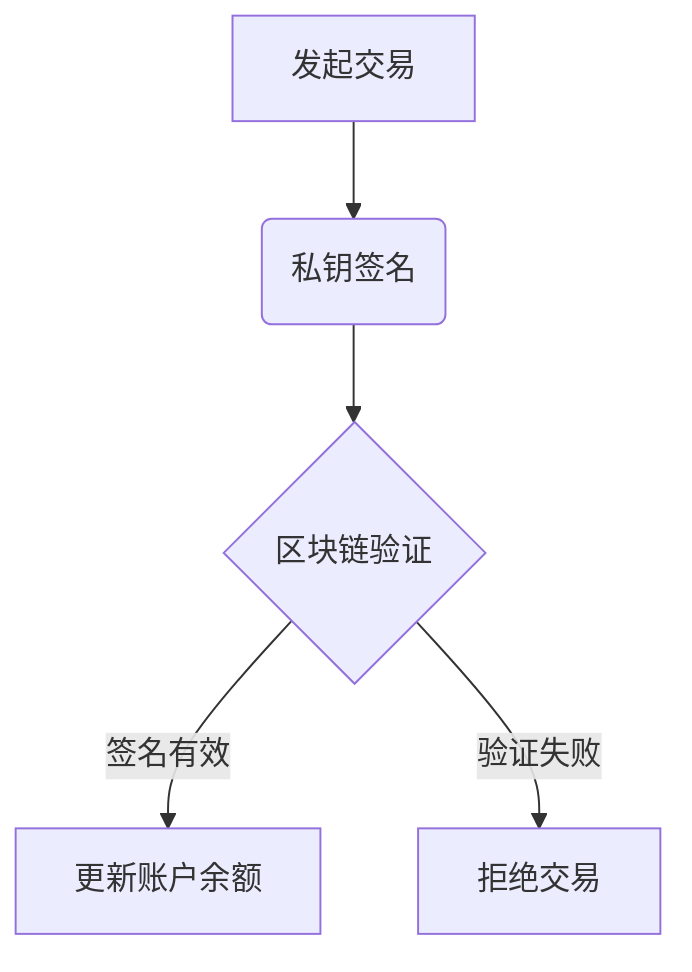

# 以太坊账户、私钥与地址深度解析：区块链安全核心技术详解

## 一、以太坊账户的本质与运作机制
在区块链技术架构中，以太坊账户系统构成了价值转移的核心基础。与传统银行账户体系不同，区块链账户本质上是由密码学算法生成的数学实体。当用户发起以太币转账时，实质是在区块链账本上执行资产所有权的变更操作。

> **关键机制**：区块链通过密码学验证确保交易合法性，而非依赖中心化机构背书

通过以下步骤完成价值转移：
1. 用户发起交易指令
2. 区块链验证账户余额
3. 通过私钥生成数字签名
4. 矿工验证签名有效性
5. 更新全局状态树

## 二、地址生成技术路径解析
### 1. 密钥对创建流程
以太坊采用椭圆曲线密码学（ECDSA）生成密钥对，具体参数为：
```text
椭圆曲线：secp256k1
私钥长度：256位（32字节/64位十六进制）
公钥长度：512位（64字节）
地址长度：160位（20字节/40位十六进制）
```

### 2. 地址生成步骤分解
| 步骤 | 操作内容 | 输出结果 |
|------|----------|----------|
| 1 | 生成256位随机私钥 | 64位十六进制字符串 |
| 2 | 通过ECDSA生成公钥 | 128位十六进制字符串 |
| 3 | 对公钥执行Keccak-256哈希 | 64位十六进制字符串 |
| 4 | 取哈希值后20字节 | 40位十六进制地址 |

> **安全警示**：手动创建私钥需保证真随机性，推荐使用硬件钱包生成

## 三、密码学体系的核心作用
### 1. 密钥对的功能区分
- **私钥**：数字签名生成与交易授权
- **公钥**：签名验证与地址推导
- **地址**：资产接收与账户标识

### 2. 交易验证流程


## 四、安全实践与常见误区
### 1. 私钥保护黄金法则
- 离线存储：使用冷钱包或硬件钱包
- 多重备份：至少保存3份加密副本
- 权限隔离：不同用途使用独立账户
- 定期审计：检查异常交易记录

### 2. 常见认知误区
| 误区类型 | 正确认知 | 风险等级 |
|----------|----------|----------|
| 明文存储私钥 | 必须加密存储 | 高危 |
| 重复使用地址 | 建议每次交易使用新地址 | 中危 |
| 公钥保密 | 公钥可公开验证交易 | 低危 |

👉 [掌握区块链核心技术精髓](https://bit.ly/okx_welcome)

## 五、FAQ：高频问题解答
### Q1: 私钥丢失后能否恢复账户？
A: 无法恢复。私钥是唯一控制凭证，丢失即永久失去资产控制权。建议使用助记词备份并物理隔离存储。

### Q2: 如何验证地址真实性？
A: 通过区块链浏览器校验地址格式有效性，使用EIP-55标准地址可检测输入错误。交易前建议小额测试。

### Q3: 量子计算会威胁现有加密体系吗？
A: 理论存在威胁，但当前量子计算机尚未达到破解256位加密的算力。以太坊基金会正在研发抗量子升级方案。

### Q4: 什么是分层确定性钱包？
A: HD钱包通过种子生成多级密钥树，仅需备份初始种子即可恢复全部账户，符合BIP-44标准，支持无限扩展。

👉 [探索区块链安全解决方案](https://bit.ly/okx_welcome)

## 六、进阶应用与最佳实践
### 1. 多签账户安全架构
- 2/3多签方案：适用于机构账户管理
- 时间锁合约：设置延迟转账机制
- 社交恢复机制：指定可信联系人协助恢复

### 2. 钱包选择决策矩阵
| 钱包类型 | 安全等级 | 使用便捷性 | 适用场景 |
|----------|----------|------------|----------|
| 硬件钱包 | ★★★★★ | ★★★☆☆ | 长期存储 |
| 软件钱包 | ★★★☆☆ | ★★★★★ | 日常交易 |
| 纸钱包 | ★★★★☆ | ★☆☆☆☆ | 极端安全需求 |

👉 [获取专业级区块链安全工具](https://bit.ly/okx_welcome)

## 七、未来演进方向
1. **账户抽象化提案**：将外部账户与合约账户统一管理
2. **零知识证明应用**：增强交易隐私保护
3. **抗量子加密迁移**：准备应对量子计算威胁
4. **跨链账户体系**：建立多链统一身份认证

区块链安全体系持续进化，理解底层密码学原理是保障数字资产安全的核心基础。随着Web3.0生态发展，账户管理技术将向更智能、更安全的方向演进。