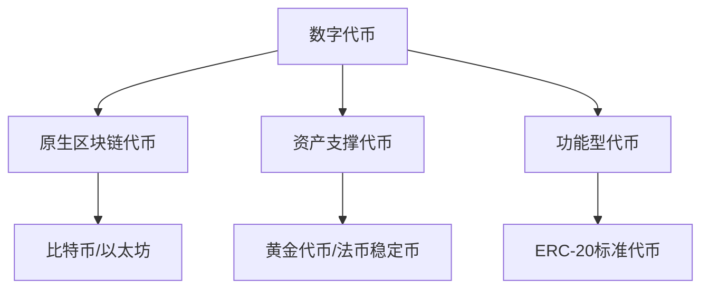

# 加密货币圣经：数字货币、数字资产、加密交易与区块链的过去与未来

## 加密货币的核心价值与技术基础

在数字化浪潮席卷全球的今天，加密货币与区块链技术正重塑金融世界的底层架构。作为第一本系统阐述货币与代币世代价值的专业著作，本书将带您深入理解比特币、以太坊等数字资产的运作逻辑，解析区块链技术如何突破传统金融体系的边界。

👉 [探索全球领先的加密货币交易平台](https://bit.ly/okx_welcome)

### 货币演进的千年脉络
从贝币到法币，货币形态历经五次重大变革：
1. 实物货币（公元前3000年）
2. 金属货币（公元前700年）
3. 纸币流通（公元1023年中国交子）
4. 法定货币体系（1944年布雷顿森林体系）
5. 数字货币时代（2009年比特币诞生）

区块链技术的出现标志着第六次货币革命的开端。不同于传统货币体系，加密货币通过密码学算法和分布式账本技术，实现了价值的点对点传输。这种无需信任第三方的交易模式，正在重构全球金融基础设施。

### 区块链技术的三大核心要素
| 技术维度 | 公有链特征 | 联盟链特征 |
|---------|------------|------------|
| 权限控制 | 完全开放 | 参与者需授权 |
| 数据存储 | 全节点同步 | 指定节点存储 |
| 共识机制 | PoW/PoS等 | PBFT/Raft等 |

公有链如比特币网络强调去中心化，联盟链则在金融机构间建立协作框架。这种技术分野对应着不同的应用场景，从跨境支付到供应链管理，区块链正在释放其变革潜力。

👉 [立即体验区块链应用场景](https://bit.ly/okx_welcome)

### 加密资产投资全景图
数字资产市场已形成完整的生态体系：
- **价值存储类**：比特币（BTC）、黄金代币
- **智能合约平台**：以太坊（ETH）、EOS
- **隐私保护币种**：门罗币（XMR）、大零币（ZEC）
- **功能型代币**：Filecoin（数据存储）、BAT（广告生态）

2023年市场数据显示，全球数字资产市值突破1.2万亿美元，日均交易量达450亿美元。投资者需特别关注：
1. 资产流动性（市场深度）
2. 技术迭代风险
3. 监管政策变化
4. 钱包安全管理

### 代币经济的三种形态

原生代币如比特币通过工作量证明维持网络运行，资产支撑代币需建立实物储备证明体系，功能型代币则与具体应用场景深度绑定。这种分类方式帮助投资者理解不同代币的价值支撑逻辑。

👉 [了解代币投资全攻略](https://bit.ly/okx_welcome)

## 常见问题解答（FAQ）

**Q：区块链技术如何保证交易安全性？**
A：通过非对称加密、哈希链和分布式共识三大机制实现：
1. 椭圆曲线加密（ECC）保障账户安全
2. Merkle树结构确保数据不可篡改
3. PoW/PoS共识机制防止双花攻击

**Q：如何选择数字钱包？**
A：根据存储方式分为：
- 热钱包（交易所钱包/软件钱包）
- 冷钱包（硬件钱包/纸钱包）
建议长期持有者使用硬件钱包，频繁交易者可配置多重签名钱包

**Q：首次代币发行（ICO）的风险控制要点**
A：需重点防范：
1. 项目方背景真实性核查
2. 智能合约代码审计
3. 代币经济模型合理性
4. 合规性审查（STO/IEO等模式）

**Q：区块链技术的主要应用场景**
A：当前成熟应用领域：
- 跨境支付（Ripple网络）
- 供应链溯源（VeChain）
- 数字身份认证（uPort）
- 去中心化存储（IPFS/Filecoin）

**Q：如何防范加密货币诈骗？**
A：识别五类常见骗局：
1. 虚假交易所平台
2. 钓鱼网站仿冒
3. 传销币资金盘
4. 假冒钱包应用
5. 智能合约漏洞

## 技术演进与监管框架

区块链3.0时代呈现三大趋势：
1. 跨链技术突破（Polkadot/Cosmos）
2. 零知识证明应用（Zcash的zk-SNARKs）
3. 监管科技（RegTech）融合

各国监管政策呈现差异化格局：
- 美国：证券法框架监管代币发行
- 欧盟：MiCA法案建立统一监管体系
- 中国：禁止加密货币交易但支持区块链技术
- 新加坡：MAS监管沙盒促进创新

这种监管博弈推动行业向合规化发展，STO（证券型代币发行）成为重要转型方向。2023年全球STO市场规模已达80亿美元，涵盖房地产、艺术品等多元化资产类别。

👉 [获取最新监管动态](https://bit.ly/okx_welcome)

## 投资策略与风险管理

构建数字资产投资组合需遵循：
1. 风险平价策略：分配5-15%资产
2. 行业分散：基础链/DeFi/NFT/元宇宙
3. 周期管理：采用定投策略平滑波动

典型风险管理工具：
- 止损订单（Stop Loss）
- 期权对冲（Deribit平台）
- 多签钱包（BitGo托管）

投资者教育重点：
1. 掌握钱包私钥管理
2. 理解智能合约原理
3. 识别项目白皮书风险
4. 合规纳税申报

## 未来展望

随着CBDC（央行数字货币）的推进，加密货币市场将形成：
- 法定数字货币
- 稳定币
- 原生加密货币
的三元结构。预计到2025年，全球数字资产市值将突破3万亿美元，区块链技术将渗透至60%以上的金融基础设施。

企业级区块链应用呈现爆发态势：
- 供应链金融（蚂蚁链服务超5000家企业）
- 贸易融资（we.trade平台）
- 数字身份（微软ION系统）

这种技术融合将持续推动金融体系的开放与重构，创造价值互联网的新范式。